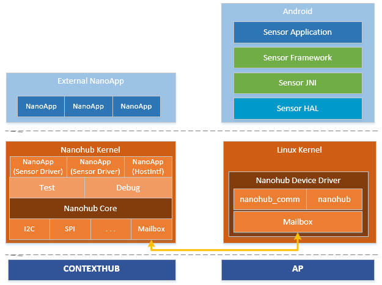
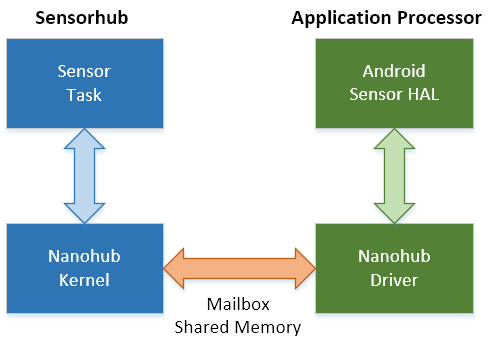

## Sensorhub Firmware 

### Table of Contents
1. [Overview](#overview)
2. [Directory Structure](#directory_structure)
3. [How to Build](#how_to_build)
4. [Variant](./firmware/variant/)
5. [Device Driver APIs](./firmware/os/platform/exynos/doc/)


### 1. Overview <a name="overview"></a>
Sensorhub firmware is based on the Android AOSP and the repository is under "device/google/contexthub" of Android Platform. It is modified to support Exynos product.

The mail role of Sensorhub F/W is to control sensors and to communicates with AP. Sensor control can be done through I2C or SPI channel and some interrupt signals and the communication with AP can be done through Mailbox and shared SRAM.

This image shows the overall architecture of sensor stack.<br>

<br><br><br>



Sensorhub F/W consists of two images, bootloader and os.

**Bootloader**
On boot, bootloader runs firstly, and if it find a pre-loaded os image, bootloader validates it and resume boot sequence.

**OS**
Main software and consists of a kernel(nanohub kernel) with multiple tasks, sharing system resources such as the CPU, timers, RAM and peripherals.

There are APIs for tasks to access hardware resources
- Hardware APIs for :
  - GPIOs
  - Interrupts
  - Timers
  - I2C
  - SPI
  - Other System Peripherals
<br>

---
<br>

### 2. Directory Structure <a name="directory_structure"></a>
<pre>
firmware +--- app
         +--- build
         +--- external
         +--- lib
         +--- os
         |    +--- algos
         |    +--- core
         |    +--- cpu
         |    +--- drivers        <-- Sensor Drivers
         |    +--- inc
         |    +--- platform
         |         +--- exynos    <-- Device Drivers for Exynos
         |              +--- inc  <-- Header Files
         |              +--- lkr  <-- Linker Scripts
         |              +--- misc
         |              +--- src  <-- Source Files
         +--- variant
              +--- erd9630
              ...
</pre>

**Sensor Driver**<br>
Sensor Driver files are under firmware/os/drivers/.

**Device Driver BSP**<br>
BSPs for Exynos platform are under firmware/os/platform/exynos/.

**Board Specific Files**<br>
Board specifice files are under firmware/variant/\<variant name\>/.
<br>

---
<br>

### 3. How to build <a name="how_to_build"></a>

Image can be build with the build script.
The usage of build script is:

    build.sh variant_name [other options]

At first, the script check the environment variable of toolchain and if it is not configured,   install toolchain by running toolchain-setup.sh

toolchain-setup.sh download toolchain and configure the following environment variables.
- ARM_NONE_GCC_PATH=$HOME/toolchains/gcc-arm-none-eabi-5_3-2016q1
- CROSS_COMPILE=$ARM_NONE_GCC_PATH/bin/arm-none-eabi-
- NANOHUB_TOOLCHAIN=$CROSS_COMPILE
<br>

Usage of build.sh:
```bash
  cd firmware
  ./build.sh erd9630
  ./build.sh erd9630 all
  ./build.sh erd9630 clean
  ./build.sh erd9630 1
  ./build.sh erd9630 1,3
  ./build.sh erd9630 ACC=BMI160
  ./build.sh erd9630 all ACC=BMI160
  ./build.sh erd9630 1,3,5 ACC=BMI160
```

The first parameter(erd9630 in above example) is the ***name of variant*** and it should be equal to the name of directory under firmware/variant.

Other parameters could be the following options:

    all     : build for all sensor combination
    clean   : remove output files
    number  : the number of sensor combination
        1   :  build for sensor combination #1
        1,3 : build for sensor combination #1 and #3
    Other compile options
        Key=Value : add compile option

<br>
Output files are generated in firmware/out/nanohub/*variant_name*.

Output files:

    bootloader
        bl.unchecked.bin
        bl.unchecked.elf
    os image (when does not support multi sensor combination)
        os.checked.bin
        os.checked.elf
    os image (when support multi sensor combination)
        os.checked_#.bin
        os.checked_#.elf
<br>

**Memory Map:**<br>
Memory map is defined in linker script in firmware/os/platform/exynos/lkr/***variant_name***.map.lkr.

For example for variant name of erd9630:

    MEMORY
    {
        bl      : ORIGIN = 0x00000000,  LENGTH = 4K
        code    : ORIGIN = 0x00001000,  LENGTH = 130K
        ipc     : ORIGIN = 0x00021800,  LENGTH = 90K
        ram     : ORIGIN = 0x00038000,  LENGTH = 192K
        shared  : ORIGIN = 0x00068000,  LENGTH = 0K
    }
<br>

---
<br>
